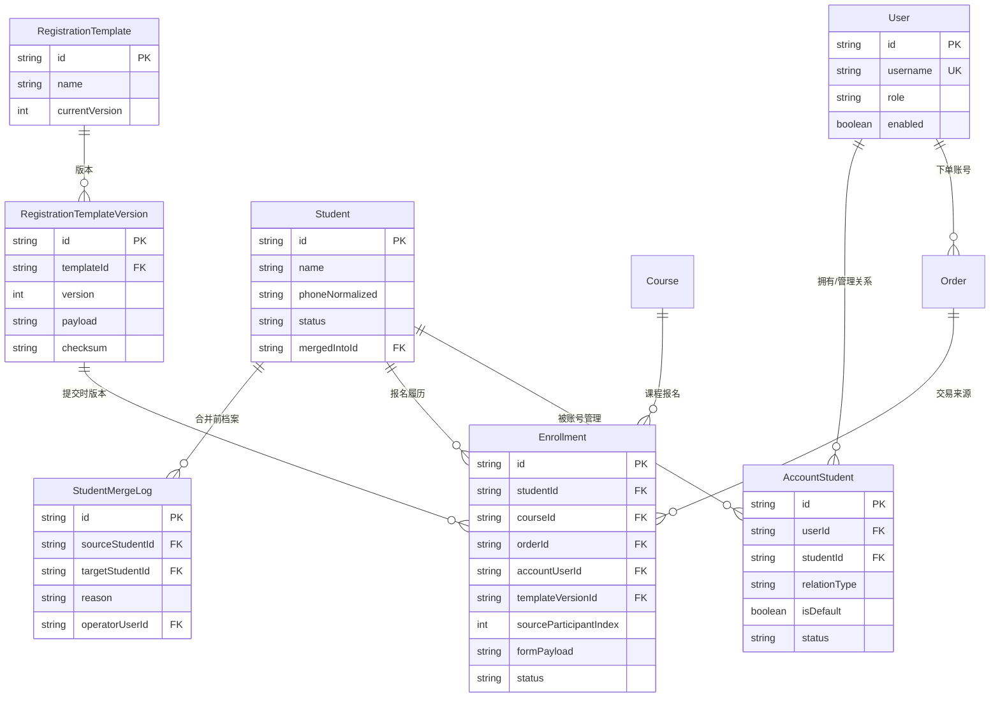

# 学员域数据库设计方案

> 设计基线：2026-07-31
>
> 依据文件：
> - `Docs/Summary/用户管理_学员管理_报名信息存储关系分析.md`
> - `Docs/Summary/2026-07-31_学员域重构与真实联动项目现状总结.md`
> - `Docs/Plans/2026-07-31_脱离Mock的前后端数据库联动任务规划.md`
> - `backend/api/prisma/schema.prisma`
>
> 本文是数据库设计草案，不直接修改现有 schema 或执行迁移。实际开发必须从任务规划 P1 开始，经过备份、迁移、回填、双写、对账和回滚验收后再上线。

## 1. 设计目标

### 1.1 需要解决的问题

当前系统把报名人数组列化保存于 `Order.participants`，可以满足 MVP 查看订单报名人，但无法稳定支持：

- 一个账号长期管理多个学员；
- 同一学员跨课程查询报名履历；
- 学员基础资料复用和维护；
- 报名模板版本追溯；
- 历史数据去重、合并、异常处理和对账；
- 学员权限、敏感字段脱敏和审计。

### 1.2 设计原则

1. **账号、学员、报名履历、订单分责**：`User` 不代替 `Student`，`Order` 不代替 `Enrollment`。
2. **历史可追溯**：每条报名履历保存当次模板版本和表单快照，不能被后续模板或档案修改覆盖。
3. **渐进迁移**：新增表和索引，保留 `Order.participants`，采用历史回填、事务双写、新读旧留、对账切换。
4. **授权优先**：C 端只能访问当前账号有 `AccountStudent` 关系的学员；管理端按角色控制查看、编辑、合并和导出。
5. **可幂等、可回滚**：迁移和下单都要有稳定幂等键；任何一步失败不得产生半成功数据。
6. **SQLite 兼容、可升级**：首版继续兼容当前 Prisma + SQLite，避免依赖数据库特有 JSON 查询；将来迁移 PostgreSQL 时不改变领域关系。

## 2. 当前数据库基线

当前已有主要表：

| 表 | 当前用途 | 与学员域的关系 |
|---|---|---|
| `User` | 登录账号、下单和交易责任主体 | 目标中继续作为账号主体 |
| `Course` | 课程、容量、价格和当前模板关联 | 目标中关联多个 `Enrollment` |
| `RegistrationTemplate` | 模板字段定义 JSON 和当前版本 | 目标中增加不可变版本记录 |
| `Order` | 金额、支付、退款、发票和订单报名快照 | 目标中继续保留交易职责和兼容快照 |
| `PaymentProof` | 线下支付凭证和审核状态 | 继续通过 `Order` 关联 |
| `AuditLog` | 通用操作审计 | 覆盖档案、关系和合并操作，必要时增加专用明细表 |

当前不存在：

- `Student` 学员主档案表；
- `AccountStudent` 账号与学员授权关系表；
- `Enrollment` 课程报名履历表；
- 可追溯的模板版本历史表。

现状关系为：

```text
User ──< Order ──< participants(JSON)
                       └─ 管理端“学员管理”和“报名明细”展开结果
```

## 3. 目标逻辑模型



## 4. 表设计

### 4.1 `User`：账号主体（保留并补充关系）

当前 `User` 表继续使用，不把学员基础资料复制到用户表。新增关系字段只通过关联表实现。

| 字段 | 类型 | 规则 | 说明 |
|---|---|---|---|
| `id` | String | PK | 账号编号 |
| `username` | String | UNIQUE | 登录账号 |
| `role` | String | `user/admin` | 权限角色，后续可扩展权限表 |
| `enabled` | Boolean | 默认 true | 账号状态 |
| `phone/email/name/company` | String? | 按现有 schema | 账号资料，不等同于学员档案 |

不建议在 `User` 上增加 `studentId`：一个账号可以管理多个学员，且企业联系人和参训人可能不是同一人。

### 4.2 `Student`：学员主档案

保存可跨订单、跨课程复用的人员基础资料。档案停用使用状态，不物理删除。

| 字段 | 类型 | 必填 | 规则/说明 |
|---|---|---:|---|
| `id` | String | 是 | `STU-...`，PK |
| `name` | String | 是 | 当前有效姓名；历史报名姓名保存在履历快照 |
| `phone` | String? | 否 | 展示用联系方式，建议脱敏输出 |
| `phoneNormalized` | String? | 否 | 去空格、分隔符和国家码后的匹配值；可建普通索引，不做无条件全局唯一 |
| `gender` | String? | 否 | 基础资料 |
| `email` | String? | 否 | 基础资料 |
| `company` | String? | 否 | 企业/单位 |
| `department` | String? | 否 | 部门 |
| `position` | String? | 否 | 职务 |
| `status` | String | 是 | `active/inactive/merged` |
| `mergedIntoId` | String? | 否 | 合并后指向主档案；自引用关系 |
| `extraPayload` | String? | 否 | 暂未结构化的扩展资料 JSON，不参与核心匹配 |
| `createdByUserId` | String? | 否 | 首次创建账号或管理员 |
| `createdAt/updatedAt` | DateTime | 是 | 审计时间 |

去重策略：

- 手机号规范化后可生成候选，不自动覆盖姓名、公司等冲突字段；
- 手机号为空时不得自动强合并，只能创建候选并人工确认；
- `merged` 档案保留，所有履历和关系转移后仍可追溯。

### 4.3 `AccountStudent`：账号与学员授权关系

用关系表支持“一账号多学员”和受控的“多账号管理一个学员”。

| 字段 | 类型 | 必填 | 说明 |
|---|---|---:|---|
| `id` | String | 是 | PK |
| `userId` | String | 是 | 账号 FK |
| `studentId` | String | 是 | 学员 FK |
| `relationType` | String | 是 | `self/employee/agent/guardian/other` |
| `isDefault` | Boolean | 是 | 该账号默认报名人，账号最多一个有效默认关系 |
| `source` | String | 是 | `user_created/admin_created/migration` |
| `status` | String | 是 | `active/revoked` |
| `createdByUserId` | String? | 否 | 授权操作者 |
| `revokedAt` | DateTime? | 否 | 解除关系时间 |
| `createdAt/updatedAt` | DateTime | 是 | 审计时间 |

约束：

- `@@unique([userId, studentId])`，解除关系使用 `status`，不重复插入；
- 应用层保证同一账号最多一个有效 `isDefault = true`；
- 关系解除不删除历史 `Enrollment` 和 `Order`。

### 4.4 `RegistrationTemplate`：逻辑模板

现有表目前同时承担逻辑模板和当前 JSON。建议保留其 ID 作为稳定引用，并将可变的字段定义迁移到版本表。

| 字段 | 类型 | 说明 |
|---|---|---|
| `id` | String PK | 模板逻辑编号 |
| `name` | String | 模板名称 |
| `currentVersion` | Int | 当前发布版本 |
| `status` | String | `draft/published/disabled` |
| `createdAt/updatedAt` | DateTime | 生命周期 |

兼容期可保留现有 `version`、`payload` 字段，但新写入应先创建版本记录，再更新当前指针。

### 4.5 `RegistrationTemplateVersion`：不可变模板版本

防止后续编辑模板导致历史报名无法解释。

| 字段 | 类型 | 规则/说明 |
|---|---|---|
| `id` | String | PK |
| `templateId` | String | FK 到逻辑模板 |
| `version` | Int | 与模板组合唯一 |
| `payload` | String | 字段定义 JSON，只读 |
| `checksum` | String | payload hash，便于校验 |
| `status` | String | `draft/published/retired` |
| `createdByUserId` | String? | 发布人 |
| `publishedAt` | DateTime? | 发布时间 |
| `createdAt` | DateTime | 创建时间 |

约束：`@@unique([templateId, version])`。历史版本不更新、不删除。

### 4.6 `Order`：交易主体和兼容快照

现有 `Order` 保留金额、折扣、支付、状态、发票和 `participants`。建议增加：

| 字段 | 类型 | 说明 |
|---|---|---|
| `templateIdSnapshot` | String? | 创建订单时使用的逻辑模板 ID |
| `templateVersionSnapshot` | Int? | 创建订单时使用的模板版本 |
| `participantsSchemaVersion` | Int | JSON 快照结构版本，默认 1 |
| `legacyMigrationStatus` | String? | `pending/success/manual/ignored`，供回填追踪 |

`participants` 在兼容期继续保存原始数组。新订单中它必须与对应 `Enrollment.formPayload` 使用同一份输入快照序列化，不能由档案当前值重新生成。

### 4.7 `Enrollment`：报名履历

一名学员参加一门课程的一次报名对应一条记录。它是学员跨课程历史和报名明细的主表。

| 字段 | 类型 | 必填 | 说明 |
|---|---|---:|---|
| `id` | String | 是 | PK |
| `studentId` | String | 是 | 学员 FK |
| `courseId` | String | 是 | 课程 FK |
| `orderId` | String? | 否 | 订单 FK；后台补录可为空 |
| `accountUserId` | String | 是 | 下单/责任账号 FK，不能只从订单反推 |
| `sourceParticipantIndex` | Int | 是 | 原订单 participants 数组序号 |
| `templateVersionId` | String? | 否 | 提交时模板版本 FK；旧数据可为空并标记 legacy |
| `templateVersion` | Int? | 否 | 兼容冗余字段，便于快速展示 |
| `formPayload` | String | 是 | 当次报名表单 JSON 快照 |
| `status` | String | 是 | `registered/cancelled/completed/absent` |
| `registeredAt` | DateTime | 是 | 报名时间 |
| `cancelledAt/completedAt` | DateTime? | 否 | 履历状态时间 |
| `createdAt/updatedAt` | DateTime | 是 | 审计时间 |

建议索引和幂等约束：

- `@@index([studentId, registeredAt])`：学员跨课程历史；
- `@@index([courseId, status])`：课程报名统计；
- `@@index([accountUserId, registeredAt])`：账号代报名查询；
- `@@unique([orderId, sourceParticipantIndex])`：同一订单报名人序号只生成一条履历；
- 课程是否允许同一学员重复报名由业务规则控制，不用简单的全局唯一约束替代。

支付状态原则：订单支付状态仍以 `Order.status` 为准；履历页面通过 `orderId` 关联订单展示支付状态，避免在 `Enrollment` 和 `Order` 之间形成无法同步的双重状态。只有离线补录或报表需要时，才增加明确命名的状态快照字段。

### 4.8 `StudentMergeLog`：档案合并明细

通用 `AuditLog` 记录操作入口；专用表保存合并前后数据关系，便于回滚和审计。

| 字段 | 类型 | 说明 |
|---|---|---|
| `id` | String | PK |
| `sourceStudentId` | String | 被合并档案 |
| `targetStudentId` | String | 主档案 |
| `operatorUserId` | String | 操作者 |
| `reason` | String | 合并理由 |
| `snapshotPayload` | String | 合并前关键字段快照 |
| `createdAt` | DateTime | 操作时间 |

合并操作必须在事务中完成：写日志 → 转移关系 → 转移履历 → 标记源档案 `merged`，任一步失败整体回滚。

### 4.9 迁移运行与异常记录

为支持 P2 断点续跑和异常人工处理，建议增加两张运维表，或在首版先使用等价的批次 JSON 文件：

#### `StudentMigrationBatch`

保存批次号、开始/结束时间、游标、状态、源数据快照校验值和统计数量。

#### `StudentMigrationIssue`

保存 `batchId`、`orderId`、`sourceParticipantIndex`、异常类型、原始 payload 摘要、处理状态和处理人。建议对 `[orderId, sourceParticipantIndex]` 建唯一约束，避免重复异常。

## 5. 推荐 Prisma 设计草案

下面是目标模型的核心示意，字段可根据项目统一 ID 生成器和命名规范微调。此代码不能在未完成迁移准备前直接复制到生产 schema。

```prisma
model Student {
  id                String           @id
  name              String
  phone             String?
  phoneNormalized   String?
  gender            String?
  email             String?
  company           String?
  department        String?
  position          String?
  status            String           @default("active")
  mergedIntoId      String?
  extraPayload      String?
  createdByUserId   String?
  createdAt         DateTime         @default(now())
  updatedAt         DateTime         @updatedAt
  mergedInto        Student?         @relation("StudentMerge", fields: [mergedIntoId], references: [id], onDelete: SetNull)
  mergedSources     Student[]        @relation("StudentMerge")
  accountRelations  AccountStudent[]
  enrollments       Enrollment[]
  mergeSources      StudentMergeLog[] @relation("MergeSource")
  mergeTargets      StudentMergeLog[] @relation("MergeTarget")

  @@index([phoneNormalized])
  @@index([status, updatedAt])
}

model AccountStudent {
  id              String   @id
  userId          String
  studentId       String
  relationType    String   @default("other")
  isDefault       Boolean  @default(false)
  source          String   @default("user_created")
  status          String   @default("active")
  createdByUserId String?
  revokedAt       DateTime?
  createdAt       DateTime @default(now())
  updatedAt       DateTime @updatedAt
  user            User     @relation(fields: [userId], references: [id], onDelete: Cascade)
  student         Student  @relation(fields: [studentId], references: [id], onDelete: Restrict)

  @@unique([userId, studentId])
  @@index([userId, status, isDefault])
  @@index([studentId, status])
}

model Enrollment {
  id                    String    @id
  studentId             String
  courseId              String
  orderId               String?
  accountUserId         String
  sourceParticipantIndex Int
  templateVersionId     String?
  templateVersion       Int?
  formPayload           String
  status                String    @default("registered")
  registeredAt          DateTime  @default(now())
  cancelledAt           DateTime?
  completedAt           DateTime?
  createdAt             DateTime  @default(now())
  updatedAt             DateTime  @updatedAt
  student               Student   @relation(fields: [studentId], references: [id], onDelete: Restrict)
  course                Course    @relation(fields: [courseId], references: [id], onDelete: Restrict)
  order                 Order?    @relation(fields: [orderId], references: [id], onDelete: SetNull)

  @@unique([orderId, sourceParticipantIndex])
  @@index([studentId, registeredAt])
  @@index([courseId, status])
  @@index([accountUserId, registeredAt])
}

model RegistrationTemplateVersion {
  id            String   @id
  templateId    String
  version       Int
  payload       String
  checksum      String
  status        String   @default("draft")
  createdByUserId String?
  publishedAt   DateTime?
  createdAt     DateTime @default(now())
  template      RegistrationTemplate @relation(fields: [templateId], references: [id], onDelete: Restrict)

  @@unique([templateId, version])
  @@index([templateId, status])
}
```

SQLite 对 `@@unique([orderId, sourceParticipantIndex])` 中的 NULL 行为需要在集成测试中确认。若后台补录允许 `orderId = null`，应额外生成稳定的来源键，或由应用层保证补录幂等，不能仅依赖数据库唯一约束。

实际合入现有 Prisma schema 时，还需要在既有模型补充反向关系字段：`User.accountStudents`、`Course.enrollments`、`Order.enrollments`、`RegistrationTemplate.versions`，以及 `User` 与 `Enrollment.accountUserId` 的显式关系。关系字段名应先与团队现有命名统一，再生成 migration，避免只复制局部模型导致 Prisma schema 无法生成。

## 6. 事务与数据流设计

### 6.1 新订单创建

```text
请求进入
  ↓
校验账号、课程、模板版本、报名人数和容量
  ↓
逐个解析 participant：校验 studentId 权限或匹配/创建 Student
  ↓
确保 AccountStudent 关系存在（新建关系或复用已有关系）
  ↓
创建 Order（保留原始 participants 快照和模板快照）
  ↓
按数组序号创建 Enrollment（写入 formPayload 和模板版本）
  ↓
更新 Course.enrolled
  ↓
提交同一数据库事务
```

事务失败时必须整体回滚。订单 ID 或客户端幂等键要能够识别重复提交，不能重复增加课程人数。

### 6.2 C 端读取权限

1. 查询 `AccountStudent` 中当前 `userId + status = active` 的关系；
2. 只返回关联的 `Student.status = active` 档案；
3. 报名接口再次校验 `studentId`，不能信任前端列表；
4. 历史 `Enrollment` 可被当前授权账号查看，但编辑档案不反写历史快照。

### 6.3 管理端读取

- 学员档案：从 `Student` 分页查询，按关系和履历聚合摘要；
- 报名明细：从 `Enrollment` 查询，联查 `Course`、`Order`、`User` 和模板版本；
- 交易/支付：仍以 `Order`、`PaymentProof` 为准；
- 合并/导出：经过角色权限和脱敏策略，并写入 `AuditLog`。

## 7. 历史数据迁移方案

### 7.1 迁移阶段

| 阶段 | 数据库动作 | 读写策略 |
|---|---|---|
| M0 备份 | 备份 SQLite、记录 schema 和校验值 | 只读检查 |
| M1 增表 | 新增目标表、索引、模板版本表 | 旧读、旧写 |
| M2 回填 | 解析 `Order.participants`，创建档案/关系/履历 | 旧读，迁移写新表 |
| M3 双写 | 新订单同事务写旧快照和新模型 | 旧读，新旧都写 |
| M4 对账 | 比较订单人数、履历数、课程汇总和状态 | 双读但不切换 |
| M5 切换 | 后台新读，保留旧读回退开关 | 新读旧留 |
| M6 观察 | 处理异常、冻结旧写、评估下线 | 新读，旧字段只保留 |

### 7.2 匹配规则

按以下优先级生成候选，不代表自动合并：

1. 规范化手机号完全一致且姓名一致；
2. 规范化手机号一致但姓名/公司冲突，进入人工确认；
3. 无手机号时只能按姓名+公司生成候选，不自动合并；
4. 无法解析的 JSON、缺姓名或异常字段进入 `StudentMigrationIssue`。

### 7.3 幂等键

历史回填至少使用：

```text
(sourceOrderId, sourceParticipantIndex)
```

该键对应一条迁移履历。学员档案匹配结果和账号关系要通过批次/匹配表复用，避免重跑时生成多个档案。

### 7.4 对账公式

上线前必须同时满足：

```text
每个订单的 participants.length = 该订单 Enrollment 数量
有效订单 participantCount 总和 = 有效 Enrollment 数量
每门课程的有效 Enrollment 数量 = 课程报名统计人数
每条 Enrollment 可追溯 Student、Course、责任账号和模板快照
```

所有例外必须有订单号、报名人序号、原因、处理状态和负责人。

## 8. 索引、约束与性能

### 8.1 必须索引

- `Student(phoneNormalized)`、`Student(status, updatedAt)`；
- `AccountStudent(userId, status, isDefault)`、`AccountStudent(studentId, status)`；
- `Enrollment(studentId, registeredAt)`、`Enrollment(courseId, status)`、`Enrollment(accountUserId, registeredAt)`；
- `Enrollment(orderId, sourceParticipantIndex)` 唯一/幂等索引；
- `RegistrationTemplateVersion(templateId, version)` 唯一。

### 8.2 不建议的约束

- 不对 `Student.phoneNormalized` 设置无条件全局唯一：历史重复和人工合并需要保留；
- 不用 `Order.userId` 代替 `Enrollment.accountUserId`：订单账号和实际参训人可不同；
- 不在 `Enrollment` 复制完整支付状态并允许独立修改：支付真源仍是订单状态机。

### 8.3 SQLite 首版注意事项

- JSON 字段先作为快照保存，核心筛选字段必须落列；
- 大批量回填按批次提交，避免一次事务锁住整个 SQLite；
- 迁移前复制数据库文件并校验，迁移后运行 Prisma 生成和 API 冒烟测试；
- 将来切换 PostgreSQL 时再评估 JSONB、全文检索和租户隔离，不在本轮提前引入复杂依赖。

## 9. 权限、隐私与审计

| 操作 | 普通账号 | 运营人员 | 系统管理员 |
|---|---:|---:|---:|
| 查看本人授权学员 | ✓ | ✓ | ✓ |
| 新增/编辑本人授权学员 | ✓ | ✓ | ✓ |
| 查看跨账号关系 | — | 按授权 | ✓ |
| 合并学员档案 | — | 需授权 | ✓ |
| 导出手机号等敏感字段 | — | 脱敏 | 按审计授权 |
| 查看合并/迁移审计 | — | 只读 | ✓ |

手机号、邮箱和表单快照属于敏感数据：API 返回和管理端展示应按角色脱敏；日志中不得写入完整手机号、身份证或完整表单 JSON。档案查看、编辑、关系变更、合并、导出和迁移处理都要写入 `AuditLog`。

## 10. API 与数据库职责映射

| API 能力 | 主要数据源 | 写入表 |
|---|---|---|
| C 端我的学员列表 | `AccountStudent` + `Student` | — |
| C 端新增/编辑学员 | `Student`、`AccountStudent` | `Student`、`AccountStudent` |
| 创建订单 | `Course`、模板版本、授权关系 | `Order`、`Student`、`AccountStudent`、`Enrollment`、`Course` |
| 管理端学员档案 | `Student` | `Student`、`AuditLog` |
| 管理端报名明细 | `Enrollment` 联查订单/课程 | `Enrollment`、`AuditLog`（必要时） |
| 历史迁移 | `Order.participants` | 目标三表、迁移批次/异常表 |
| 学员合并 | `Student`、关系、履历 | `Student`、`AccountStudent`、`Enrollment`、`StudentMergeLog`、`AuditLog` |

## 11. 发布前验收清单

### 数据结构

- [ ] 空数据库和现有数据库均能完成迁移；
- [ ] `Student`、`AccountStudent`、`Enrollment`、模板版本表索引和关系正确；
- [ ] `Order.participants` 未被删除，旧接口仍能读取；
- [ ] 所有历史履历都保存来源订单、报名序号和模板快照或明确标记 legacy。

### 业务一致性

- [ ] 本人报名、代多人报名、已有学员复用和临时填写均可落库；
- [ ] 重复提交不会重复增加课程人数或履历；
- [ ] 订单取消/支付审核后的状态在履历查询中一致；
- [ ] 合并操作可追溯、可审计、可回滚。

### 安全与运维

- [ ] 普通账号不能读取其他账号未授权学员；
- [ ] 敏感字段脱敏，日志不记录完整敏感 payload；
- [ ] 迁移批次有备份、游标、异常清单和恢复步骤；
- [ ] 迁移、双写、切换和回滚均在测试数据库演练通过。

## 12. 实施顺序

1. **P0**：冻结业务口径、备份数据库、建立环境开关；
2. **P1**：按本文模型新增表、索引和模板版本记录；
3. **P2**：编写历史回填、幂等和对账脚本；
4. **P3**：改造订单 DTO 和事务双写；
5. **P4–P6**：实现后端接口、管理端档案/明细拆分、C 端我的学员和报名选择；
6. **P7**：双读对账和新读切换；
7. **P8–P9**：Mock 边界收敛、外部渠道 adapter、E2E 和首版发布。

本文完成后，下一次代码实现应以 P1 为起点，并同步更新 FeatureList、`Docs/Plans/progress.md`、根 `progress.md` 和阶段总结。

## 13. P1 实施状态（2026-07-31）

- 已完成 Prisma schema 和 `0002_student_domain` 迁移文件；
- 已在测试库和当前主库创建四张新表及索引，SQLite `user_version` 为 5；
- 当前四张新表均为空，主库原有订单报名快照保留，未执行 P2 历史回填；
- 已生成 P1 前的一致性备份 `backend/api/data/training.pre-p1-20260731.db`；
- schema validate、迁移检查、后端测试和构建通过；
- Prisma Client 完整生成仍需处理 Windows 查询引擎文件锁定问题。
# P2 当前状态补充（2026-07-31）

已新增 `StudentMigrationBatch`、`StudentMigrationIssue` 运维模型；主库完成 21 条历史报名履历回填并通过重复执行幂等验证，SQLite `user_version=6`。P3 已将新订单纳入事务双写，P4 已完成档案/关系/履历/合并 API 与权限审计，P5 已完成管理端 Student/Enrollment 视图拆分。
